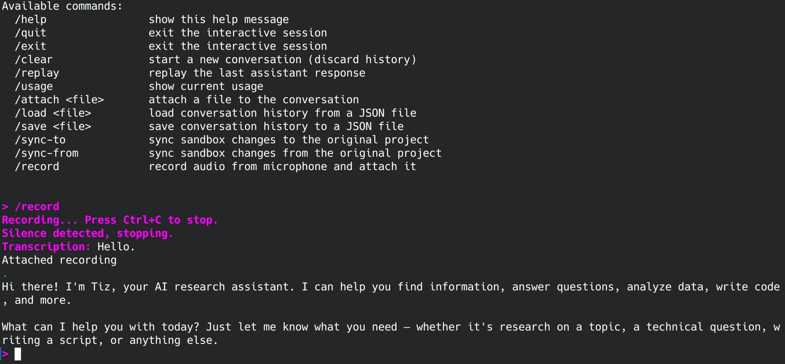
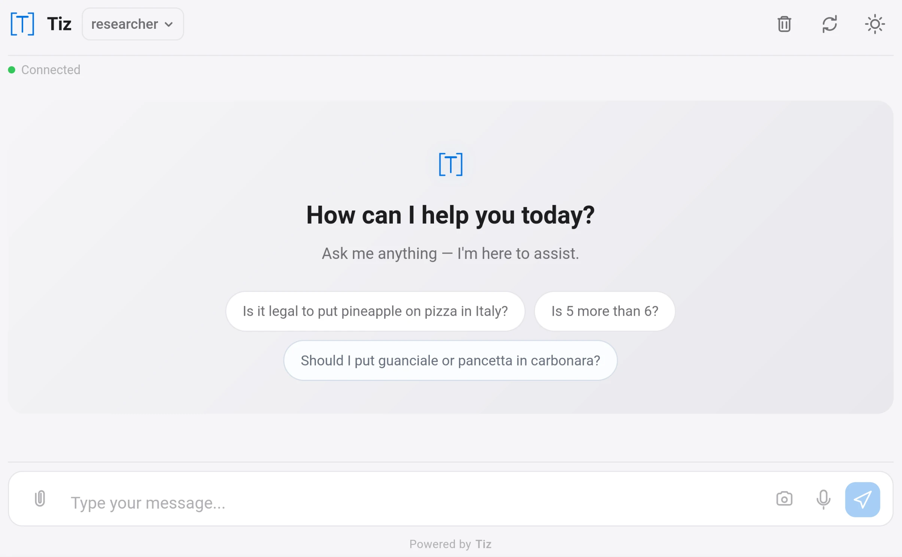
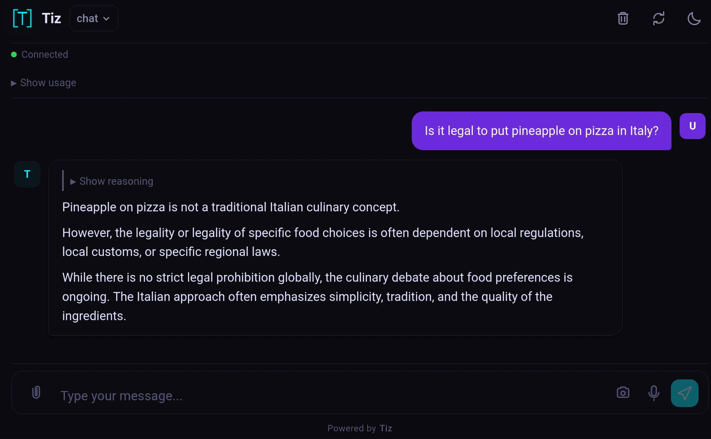

Overview
========


**Tiz** is an agentic AI bot that started as a simple coding agent for
LLMs and has become much more.

I always thought that an interactive chat was a terrible UI for a coding agent.
It forces the user to stay around between messages and either wastes a lot
of context or the time of the human operating it.

The core idea for Tiz was to build a coding agent that you could set on
long-running tasks completely unattended. For that to be safe and reliable,
two things were needed: a **sandbox** where the AI can operate freely without
damaging the host system, and a declarative **manifest** system that lets you
define complex, multi-step workflows that run without human intervention.

It turns out that a chat interface can be useful for plenty of other things:
general-purpose AI assistant, answering questions, doing research etc.
So, in the end, I also added an interactive terminal chat and a web chat.

Once you start going down the rabbit hole, things will get out of hand pretty
quickly. So I also added a way to ask for confirmation before running
some tools. I still think that, for coding tasks, this is not necessary,
but if you want an agentic assistant that can make table reservations
for you, maybe it makes sense to force it to ask for confirmation before
POST-ing to an external API with your CC.

Tiz was written with the help of Tiz but it is [**NOT vibecoded**](#how-i-did-it).

Tiz is written for Linux and needs Podman, if it miraculously happens to run
somewhere else it's purely by accident and you are on your own.

This README.md file was written by a human. If it doesn't look like that to you,
your clanker-detector is broken.

## Table of Contents

- [Features](#features)
- [Install](#install)
- [How to use](#how-to-use)
  - [Manifest files](#manifest-files)
    - [Regular manifest](#regular-manifest)
    - [Iterator manifest](#iterator-manifest)
    - [Scoring manifest](#scoring-manifest)
    - [Chat manifest](#chat-manifest)
    - [Web manifest (with audio inference)](#web-manifest-with-audio-inference)
- [Known issues, limitations and questionable choices](#known-issues-limitations-and-questionable-choices)
- [How I Did it](#how-i-did-it)
- [Stuff made using Tiz](#stuff-made-using-tiz)
- [Contributing](#contributing)
- [AI usage policy](#ai-usage-policy)
- [License](#license)

Features
========

Features, in no particular order:

* **Sandboxed execution**: All AI tool invocations run inside containers.
  If you are working on a coding project, Tiz will create a copy of it inside
  the container and **safely** keep it in sync for you.
  It is recommended to work with a project using Git. Tiz can work also with
  directories that don't use Git, but it's much less convenient. So just
  use Git.
  Each tool can run in different sandboxes with different levels
  of access to the project code (read/write, read-only, no access at all)
  and with or without Internet access (Internet access is always limited to
  Internet-only, which means any local network address is unreachable)
  There are dedicated tools for package management that make it possible to
  install packages without granting internet access to the generic Bash tool.
  It is also possible to explicitly require confirmation for use of specific tools
  in specific ways. This is meant to be used only for tools that make changes
  using external APIs.

* **Declarative manifests**: Define tasks in YAML. Manifests can describe
  complex workflows with multiple parallel tasks, iterators, scoring rounds,
  and subagents. Manifests are *composable* and you can split your configuration
  across multiple manifests that are then merged at run time.

* **Unattended operation**: Once you start a manifest, Tiz will run it to
  completion without any human intervention (unless you explicitly asked for it).
  Once finished, it will ring your terminal bell, which your terminal emulator
  hopefully maps to something better than that awful 8-bit BEEP.

* **Interactive terminal chat**: Terminal chat with readline support,
  session history, tab completion, file attachments, audio recording,
  and color-coded output. This is a simple UI, it uses some
  (customizable) colors but the colors can be completely disabled.
  Either way it *never* deletes and rewrites anything,
  it's meant to be very accessible.

* **Web chat**: Web-based chat over WebSocket. Supports multiple endpoints
  with different inference engines and system prompts, authentication headers,
  audio recording and picture taking, file upload, and progressive web
  app features (offline cache, installable). The template can also be easily
  replaced with your own.

* **File attachments**: When used in chat mode, it's possible to provide some
  files as part of the input. If the model you are using doesn't support the
  specific type of file you provided, it will be converted to an acceptable
  format (always inside a dedicated sandbox).
  e.g. your model accepts images and you attach a PDF, a .docx or a video?
  They will be automatically converted to a sequence of images and passed to the
  model explaining that those images are pages of a document or frames from
  a video.
  Your model supports audio, but not .mp3? Again, it will be converted
  transparently.
  What if your model doesn't support audio at all, or the support is bad, but
  you still want to use voice command? You can configure a separate model
  just to provide transcriptions to the main one.

* **Multiple inference backends**: Supports llama.cpp, OpenRouter,
  DwarfStar4 and it should be very easy to add support for many more.
  You can provide your own sampling parameters, timeouts, and
  SSL configuration (e.g. a custom CA)

* **Audio support**: Record audio directly from the microphone.
  Works in both CLI and web mode.

* **Rich tool set**: The AI has access to file editing tools (read, write,
  edit, apply patch, insert), filesystem tools (list, glob, grep, metadata),
  code tools (sync with uv, install Python packages, fetch Rust crates),
  web tools (fetch URLs, search the web), and subagent spawning.
  It is also easy for you to implement your own tools.

* **Prompt templates**: Jinja2-based system prompts for different modes:
  coding agent, general assistant, web research. Custom prompts work too.

* **Subagents**: A task can spawn subagents that run in their own
  containers, each with their own system prompt, tools, and inference
  engine. Results are returned to the parent agent. Subagents cannot have
  subagents to avoid the [Mr. Meeseeks recursion problem](https://en.wikipedia.org/wiki/Meeseeks_and_Destroy#Plot).

* **Parallel execution**: Multiple tasks can run in parallel using thread
  pools. Actions within a task can also be parallelized.

* **Scoring actions**: Run multiple LLMs on the same problem,
  then use a set of other LLMs to score the results and pick the best one.

* **Iterator actions**: Generate input dynamically via the LLM, split it
  into lines, and iterate a prompt for each line. Great for batch
  processing. The typical use would be to run security review tasks iteratively
  and in parallel against small chunks of the code base at each run.
  This approach was shown to be the most effective to get Mythos-like performance
  with simpler models.

* **Repeater actions**: Run a prompt group a fixed number of times with a
  Jinja2 counter variable. Good for iterative refinement.

* **Git integration**: Changes made by the AI inside the sandbox are
  committed with a configurable author name and email. The sandbox sync
  mechanism detects file changes and commits them automatically and
  **safely**.

* **Sandbox persistence**: Sandboxes persist between runs. You can enter them
  yourself and run commands.

* **Tool confirmation**: Sensitive tools (usually things that POST to external
  APIs)
  can be configured to require user confirmation before execution. Confirmation
  can be based on exact matching or regex patterns.

* **Custom tools**: Write your own tools as Python classes and plug them
  into Tiz via the manifest. You can write tools that run sandboxed or not.
  Examples in `examples/custom_tools/`.

* **Container engine support**: Works with Podman. It may work with Docker too,
  but right now that's experimental at best (as in: completely broken).

* **Multiple worker images**: Ships Containerfiles for general
  purpose (tiz-worker), Python dev (tiz-worker-py), C/C++ dev
  (tiz-worker-cpp), Rust dev (tiz-worker-rust), ESP32 dev
  (tiz-worker-esp32-5.5), reverse engineering (tiz-worker-re), and full
  Tiz development (tiz-worker-tizdev). It's easy to create your own
  customizations. Containers are built on the fly when needed.
  Or just let the LLM *manually* install dependencies at run time using the
  PM tools.

* **Usage tracking**: Tracks token usage and API credits for inference
  engines that support it (e.g. OpenRouter). Usage is accumulated across
  tasks and sessions. Can also provide some stats.

* **Shell autocomplete**: Bash/Zsh autocomplete for CLI commands via
  argcomplete.

Screenshots of Tiz in action:


*The interactive terminal chat*


*The web-based chat interface landing page light mode*


*The web-based chat interface conversation dark mode*

Install
=======

#### From PyPI

```bash
pip install tizbot
```

For audio recording support in the terminal chat:

```bash
pip install tizbot[audio]
```

For shell autocomplete:

```bash
pip install tizbot[completion]
```

For minified web assets:

```bash
pip install tizbot[minify]
```

#### From the Debian package

```bash
sudo dpkg -i tiz_0.1.0-1_all.deb
sudo apt-get install -f
```

#### From source

```bash
git clone https://github.com/smeso/tiz
cd tiz
pip install -e .
```

#### Dependencies

Tiz requires:

* **Python 3.10+**
* A container runtime: **Podman** (must be available in PATH)
* For audio recording in the terminal chat: **PyAudio** (`pip install tizbot[audio]`)
* For minified web chat: **htmlmin** and **rjsmin** (`pip install tizbot[minify]`)
* For shell autocomplete: **argcomplete** (`pip install tizbot[completion]`)

#### Quick start

Create a minimal manifest file (`manifest.yaml`):

```yaml
meta:
  version: "0"  # MUST always be 0
  committer_name: Tiz
  committer_email: tiz@example.com
inference_engines:
  - name: llamacpp
    type: llamacpp
    preserve_thinking: true
    sampling_params:
      reasoning:
        effort: xhigh
    message_timeout: 120
tasks:
  - name: test
    actions:
      - prompts:
          - Hello!
```

Now run it:

```bash
tiz run -m manifest.yaml
```

A usually better approach is to split the config a bit e.g.

`~/.tiz/config.yaml`:

```yaml
meta:
  version: "0"
  committer_name: Tiz
  committer_email: tiz@example.com
```

`~/.tiz/manifests/ds4`:

```yaml
meta:
  version: "0"
inference_engines:
  - name: ds4
    type: openrouter
    model: deepseek/deepseek-v4-flash
    preserve_thinking: true
    sampling_params:
      reasoning:
        effort: high
      provider:
        only:
          - deepseek
    api_key: env:OPENROUTER_API_KEY
    # api_key: file:/somewhere/or_api_key
    message_timeout: 120
```

`manifest.yaml`:

```yaml
meta:
  version: "0"
tasks:
  - name: test
    worker_image: tiz-worker-mytest
    worker_image_containerfile: |
                                FROM tiz-worker-python
                                USER root
                                RUN apt-get update && \
                                    DEBIAN_FRONTEND=noninteractive apt-get install -y \
                                        python3-bleak python3-cryptography && \
                                    echo "tiz-worker-mytest" > /etc/debian_chroot
                                USER ubuntu
    subagents:
      - name: Researcher
        sys_prompt: websearch
        description: use this LLM sub-agent to do some research
        tools:
          - WebFetch:
            - internet
          - WebSearch:
            - internet
    tools:
      - Bash:
        - disk
      - standard_file_manipulation:
        - disk
    project: /home/user/myproject/
    actions:
      - prompts:
          - - Analyze the project and replace any occurrence of the word Bunny with Tomato
            - Run the tests and fix any issues with them
            - Commit your changes
```

> [!NOTE]
> `prompts` is a list of lists. It can also just be a list of strings.
> Something like `['a', 'b', 'c']` is interpreted as if it was `[['a'],['b'],['c']]`.
> Using `['a', 'b', 'c']` or `[['a', 'b', 'c']]` is very different.
> With the former, each prompt gets its own context (and they can run in parallel
> if you explicitly ask).
> With the latter, they run sequentially as part of a single chat, using a single
> context.

Now run it:

```bash
tiz run -m ds4 -m manifest.yaml
```

For the web interface, you will need a couple of other manifests:

```yaml
meta:
  version: "0"
endpoints:
  chat:
    description: basic chat
    suggestions:
      - Is it legal to put pineapple on pizza in Italy?
      - Is 5 more than 6?
      - Should I put guanciale or pancetta in carbonara?
    manifests:
      - ds4
      - chat
  chat_secret:
    auth_headers:
      secret-key: verysecret
    description: only for VIPs
    suggestions:
      - How to avoid getting caught when you put pineapple on pizza in Italy?
      - Is ricotta some kind of cheese?
    manifests:
      - llamacpp
      - chat
```

`~/.tiz/manifests/chat`:

```yaml
meta:
  version: "0"
tasks:
  - name: The chat task
    dedicated_audio_engine: whisper
    tools:
      - Bash:
        - disk
      - standard_file_manipulation:
        - disk
      - WebFetch:
        - internet
      - WebSearch:
        - internet
    sys_prompt: assistant
```

```bash
tiz web web.yaml
```

Or you can just use the terminal chat:

```bash
tiz chat --hide-reasoning -m ds4 -m chat
```

How to use
==========

Tiz has three main modes of operation: **manifest execution** (unattended),
**interactive chat** (terminal), and **web chat** (browser).

### Manifest files

All modes are driven by manifest files in YAML (yes, I know) that describe
the inference engines, tasks, tools, and actions Tiz should perform.

A manifest can contain multiple inference engines, multiple tasks, and
each task can have multiple actions. Manifests can be merged by passing
multiple files to the CLI.

#### Regular manifest

A regular manifest defines one or more tasks that are executed in order or in parallel.
Each task has a name, a worker image, a list of tools, and a list of
actions.

```yaml
meta:
  version: "0"

inference_engines:
  - name: local
    type: llamacpp
    message_timeout: 120

tasks:
  - name: fix-bugs
    tools:
      - Bash:
        - disk
      - standard_file_manipulation:
        - disk
    project: ....
    actions:
      - prompts:
          - - Analyze the project at /opt/project and fix all bugs you can find.
            - After fixing, run the tests to verify.
```

Run it:

```bash
tiz run -m manifest.yaml
```

Tiz will create a sandbox, copy the project into it, and give the AI
access to the tools. The AI will work autonomously until the task is
complete. All changes are committed in the sandbox's git repository
and synced back in the original repo **safely**.

#### Iterator manifest

The iterator action generates input dynamically via an LLM prompt, splits
the output into lines, and runs a prompt group once for each line.
This is useful for batch processing a list of items generated by the AI.

```yaml
meta:
  version: "0"
  parallelism: 4
tasks:
  - name: review-files
    tools:
      - Bash:
        - disk
      - standard_file_manipulation:
        - disk
    project: ....
    actions:
      - iterator:
          parallel_message_groups: yes
          input: |
                 List all Python files in the project.
                 Output one file per line.
                 Do not write anything else.
          prompts:
            - |
              Review the file {{ item }}.
              Rewrite every print() in Klingon.
```

The `{{ item }}` Jinja2 variable is replaced with each line
output by the input prompt.

#### Scoring manifest

The scoring action runs multiple LLMs (optionally using different
inference engines) on the same prompts, then scores the results to pick
the winner. You can configure how many results to keep (`rounds`) and how
many scoring rounds to run.

```yaml
meta:
  version: "0"
tasks:
  - name: code-review
    # ...
    actions:
      - scoring:
          rounds: 4
          engines:
            - fast
            - smart
          prompts:
            - Review the code at /opt/project/main.py and make it blue.
          scoring_rounds: 3
          scoring_engines: genius
          scoring_prompt: select the bluest code
```

This will generate 4 responses (using the `fast` and `smart` engines, 2 each),
then run 3 scoring rounds (using genius engine) to pick the best one.

It can be used in combination with iterator:

```yaml
meta:
  version: "0"
tasks:
  - name: code-review
    # ...
    actions:
      - scoring:
          rounds: 4
          engines:
            - fast
            - smart
          iterator_input: |
                          List all Python files in the project.
                          Output one file per line.
                          Do not write anything else.
          prompts:
            - Review the code at {{item}} and make it blue.
          scoring_rounds: 3
          scoring_engines: genius
          scoring_prompt: select the bluest code
```

#### Chat manifest

A chat manifest is just a regular manifest.
The environment used for the chat will be the one defined by the first task
or the task selected by `--task` argument.
Any action in that task will be completely ignored and will not run.

Start an interactive chat:

```bash
tiz chat -m ds4 -m manifest.yaml --task coding
```

In the interactive chat you can use commands like:

* `/attach <file>` - Attach a file to the conversation
* `/record` - Record audio from the microphone
* `/clear` - Clear the conversation history
* `/replay` - Replay the last assistant response
* `/usage` - Show current usage
* `/load <file>` - Load conversation history from a JSON file
* `/save <file>` - Save conversation history to a JSON file
* `/sync-to` - Sync sandbox changes to the original project
* `/sync-from` - Sync sandbox changes from the original project

#### Web manifest (with audio inference)

The web mode uses a separate configuration file (`web.yaml`) that defines
one or more HTTP endpoints, each with its own manifest and options.

```yaml
meta:
  version: "0"
endpoints:
  chat:
    description: basic chat
    suggestions:
      - Is it legal to put pineapple on pizza in Italy?
      - Is 5 more than 6?
      - Should I put guanciale or pancetta in carbonara?
    manifests:
      - ds4
      - chat
  chat_secret:
    auth_headers:
      secret-key: verysecret
    description: only for VIPs
    suggestions:
      - How to avoid getting caught when you put pineapple on pizza in Italy?
      - Is ricotta some kind of cheese?
    manifests:
      - llamacpp
      - chat
```

The `chat` manifest referenced above can include an audio inference
engine for speech-to-text:

```yaml
meta:
  version: "0"
audio_inference_engines:
  - name: whisper
    type: whispercpp
    host: http://localhost:8081
    language: de
tasks:
  - name: The chat task
    dedicated_audio_engine: whisper
    tools:
      - Bash:
        - disk
      - standard_file_manipulation:
        - disk
      - WebFetch:
        - internet
      - WebSearch:
        - internet
    sys_prompt: assistant
```

Start the web server:

```bash
tiz web web.yaml
```

The server listens on port 8080 by default. Open `http://localhost:8080`
in your browser. The web interface supports PWA features too.

Known issues, limitations and questionable choices
==================================================

#### AF_UNIX path length

Unix socket paths have a maximum length (108 bytes on Linux).
When Tiz creates sandboxes with long names (based on the task name)
or Tiz's home is deeply nested, the socket path for tool communication
may exceed this limit.
When this happens, the root cause may not be reported very clearly,
even with -vvv. But you will see all tool calls fail.
I should probably check the path length upfront.

#### Man page is sloppy

The man page for `tiz` is generated automatically from the CLI help
text using `argparse-manpage`. It works, but the result is...
not great.

I'll improve this when I find the time and motivation,
so likely never.

#### Tests that test implementation details

The test suite is excessively comprehensive.
Some tests reach into implementation details that are usually best
not tested so closely. Extreme mocking gymnastics is applied, to reach
ludicrous levels of coverage and introspection.

This is intentional. I've found that testing with this level of detail
makes AI-aided development easier. Large refactors require rewriting
tons of tests, but that's why we have AI, right?

Maybe I'm wrong about this approach. We'll see.

#### Git submodules

It's A.D. 2026 and some people still use git submodules without shame.
In theory Tiz should work with submodules, as long as you only work on
the top level repo (each submodule should be treated as its own project).
But, really, just do yourself and the rest of the world a favor and
don't use submodules.

#### .tiz directory

I'm aware of the config/data split that the `XDG Base Directory Specification`
would like to achieve.
But it was easier for me to just use a single directory for everything.
Maybe I'll change this later.

#### Container engine abstraction

I didn't want to go down the road of extreme abstractions, but I also
wanted to have at least a chance to support more than just Podman.
Also I didn't want to force people to run Podman services.
So I decided to just wrap everything in exec calls to the Podman CLI.
I know that this is a terrible sin and I'll share my place in hell with
people who mix tabs and spaces.
My justification is that the CLI is the only API that is kind of stable
across different tools. So, in theory, I could add support for things
other than Podman easily. In theory.

#### CI is very basic

The CI is almost non-existent. This will be improved.

#### YAML

Everyone hates YAML, I know.
But I kind of like it, so I picked it as the format for the manifests.
Also, parser errors are extremely cryptic and if you get one tab wrong,
you'll need a PhD in Sumerian black magic to understand where the problem
is.
I'm sorry.
The parser error part should be fixable though.

#### Documentation

Documentation in general is lacking.
I think there is enough to be able to start
a chat with Tiz and just ask it what you need to know.
But still, the documentation should be improved.

#### No parallel tool execution

For simplicity, tool calls within the same sandbox will always execute
sequentially.
There are several cases in which they could run in parallel safely.
In the future they will run in parallel, if possible.

#### Web frontend security

The web frontend is mostly vibecoded. To prevent any security issue,
everything is served with very restrictive CSP and CORP headers.
If you put a reverse proxy in front of it make sure that those headers
are not dropped.
To make the policies effective it's necessary to put Tiz under its own,
dedicated subdomain rather than a subdirectory.
The use of a reverse proxy is strongly encouraged to provide HTTPS and
authentication.

#### Non-git project dir

Tiz can work with project dirs that are not Git repositories.
I think that adding support for them was a mistake and I'll likely
remove the support in the near future.

#### WebSearch uses only DuckDuckGo via unofficial APIs

The WebSearch tool uses the best search engine in the world
[citation needed], but it does so in a *hacky* way. The bot
might be blocked after a few searches.

#### Ways in which Tiz is not restricted

By default no attempt is made to restrict CPU usage, memory usage,
and disk usage by Tiz.
You can limit CPU usage and memory usage passing custom arguments
to Podman via `extra_container_args` task options.
You can also limit disk usage by placing Tiz's home in a dedicated
partition or setting appropriate quotas in your system.

How I Did it
============

The first version of Tiz was a Python script with **62 manually written
lines of code**. A proof-of-concept that could run bash commands in a
sandbox, call a local LLM via llama.cpp, and write the result back.
From that point I used Tiz to build Tiz itself.
Tiz is **NOT vibecoded**, except for the **web frontend** (roughly 5%
of the total code),

Tiz was written with AI assistance, but I personally:

* Designed the architecture and the API
* Reviewed every single line of code
* Sometimes even wrote some code!
* Made all the wrong decisions about trade-offs

I couldn't do the same for the web frontend, because I genuinely hope
that I'll never have to touch any web frontend or JavaScript code in my
life. The frontend was written by Tiz with minimal guidance from me.
From the outside it works well, I'm sure that if anyone looks at the JS
code they will shiver in discomfort, but is there any JS code that
doesn't cause that reaction?

Long story short: if there's a stupid mistake in the code, it's 100% my fault, I
reviewed it and approved it. Don't blame the clanker!

The LLMs I used were:

* Initially **Qwen 3.5** running on **llama.cpp** locally.
* Then I switched to **Qwen 3.6** via both **llama.cpp** and **OpenRouter**.
* Eventually I settled on **DeepSeek V4 Flash** as my primary engine.
* Other models I used recently are **DeepSeek V4 Pro**, **Qwen-AgentWorld**, and
  **GLM-5.2**

谢谢中国

By the time you read this, I may have moved on to using a different LLM.

In general, I try to use exclusively open-weight models, even if I don't
necessarily run them always locally.

Stuff made using Tiz
====================

I developed a bunch of different projects using Tiz.
I'll publish some of them and list them here soon.

Contributing
============

**Thank you** for wanting to contribute to this project!

In order to not waste your time, you are strongly encouraged to always
**open an issue before starting working on anything**, there might be
already work going on for the same feature or some aspect that
needs to be discussed.

All contribution **must** be made available under
[Apache 2.0 license](https://opensource.org/license/apache-2-0).

#### Developer Certificate of Origin

I want to make sure that all incoming contributions are correctly attributed and
licensed. A Developer Certificate of Origin (DCO) is a lightweight mechanism to
do that. The DCO is a declaration attached to every commit.
In the commit message of the contribution, the developer simply adds a
`Signed-off-by` statement and thereby agrees to the DCO, which you can find
below or at [DeveloperCertificate.org](http://developercertificate.org/).

```text
Developer's Certificate of Origin 1.1

By making a contribution to this project, I certify that:

(a) The contribution was created in whole or in part by me and I
    have the right to submit it under the open source license
    indicated in the file; or

(b) The contribution is based upon previous work that, to the
    best of my knowledge, is covered under an appropriate open
    source license and I have the right under that license to
    submit that work with modifications, whether created in whole
    or in part by me, under the same open source license (unless
    I am permitted to submit under a different license), as
    Indicated in the file; or

(c) The contribution was provided directly to me by some other
    person who certified (a), (b) or (c) and I have not modified
    it.

(d) I understand and agree that this project and the contribution
    are public and that a record of the contribution (including
    all personal information I submit with it, including my
    sign-off) is maintained indefinitely and may be redistributed
    consistent with this project or the open source license(s)
    involved.
```

Every contribution should be signed with a DCO. Usage of known identity
(such as a real or **preferred** name). No anonymous contributions will be
accepted. A DCO signed commit will contain a line like:


```text
Signed-off-by: Jane Smith <jane.smith@email.com>
```

You may type this line on your own when writing your commit messages. However, if your
user.name and user.email are set in your git configs, you can use `git commit` with `-s`
or `--signoff` to add the `Signed-off-by` line to the end of the commit message.

AI usage policy
===============

Of course, this project approves AI-assisted development, but there are some rules.

#### What is required

* Every contribution must be **reviewed by a human** before you open a PR.
* Every commit must include a **Signed-off-by** line (see DCO above).
* The human submitting the contribution takes **full responsibility** for
  the code, including any code written by AI.
* AI agents can't open pull requests or submit changes without human
  supervision.

#### What is NOT allowed

* AI agents opening PRs autonomously (without a human in the loop)
* AI agents making decisions about the project direction
* AI agents contributing under anonymous or fake identities

The rationale is simple: AI is a tool, like a compiler or a text editor.
You wouldn't let your text editor decide what features to implement, and you
shouldn't let an AI agent do it either. The human is always in charge,
at least for now.

> Once men turned their thinking over to machines in the hope that this
> would set them free. But that only permitted other men with machines
> to enslave them.

Don't stop thinking and don't stop hacking.

License
=======

Copyright 2026 Salvatore Mesoraca and contributors

Licensed under the Apache License, Version 2.0 (the "License");
you may not use this file except in compliance with the License.
You may obtain a copy of the License at

   https://www.apache.org/licenses/LICENSE-2.0

Unless required by applicable law or agreed to in writing, software
distributed under the License is distributed on an "AS IS" BASIS,
WITHOUT WARRANTIES OR CONDITIONS OF ANY KIND, either express or implied.
See the License for the specific language governing permissions and
limitations under the License.
